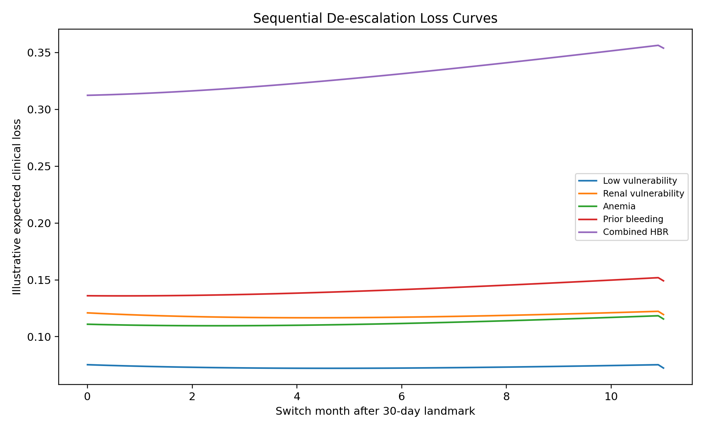
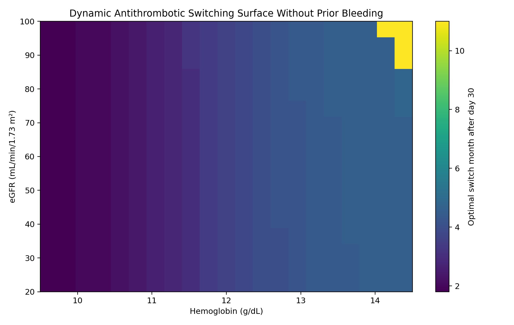
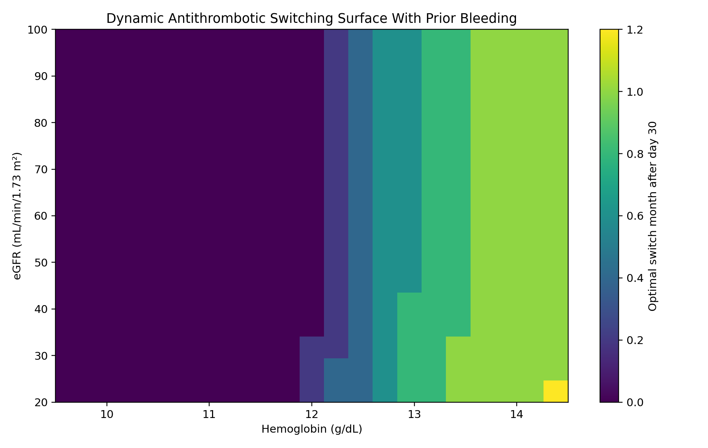
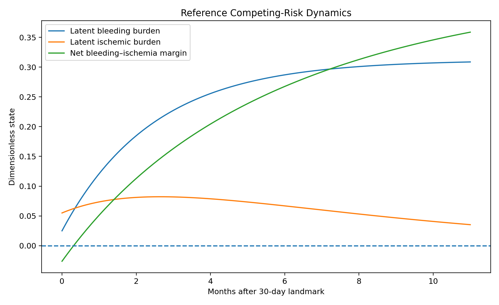
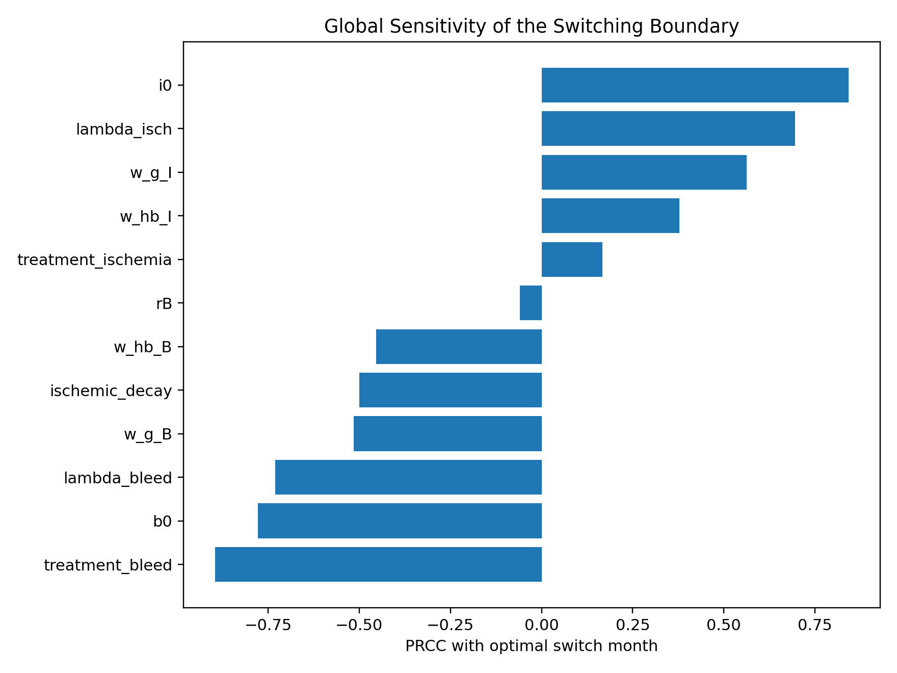
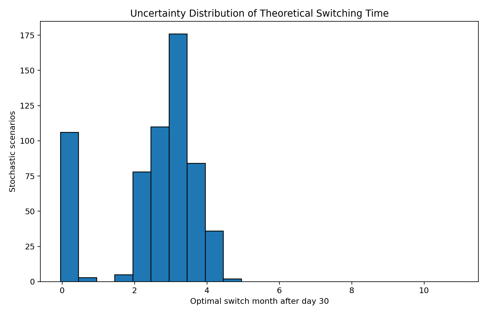
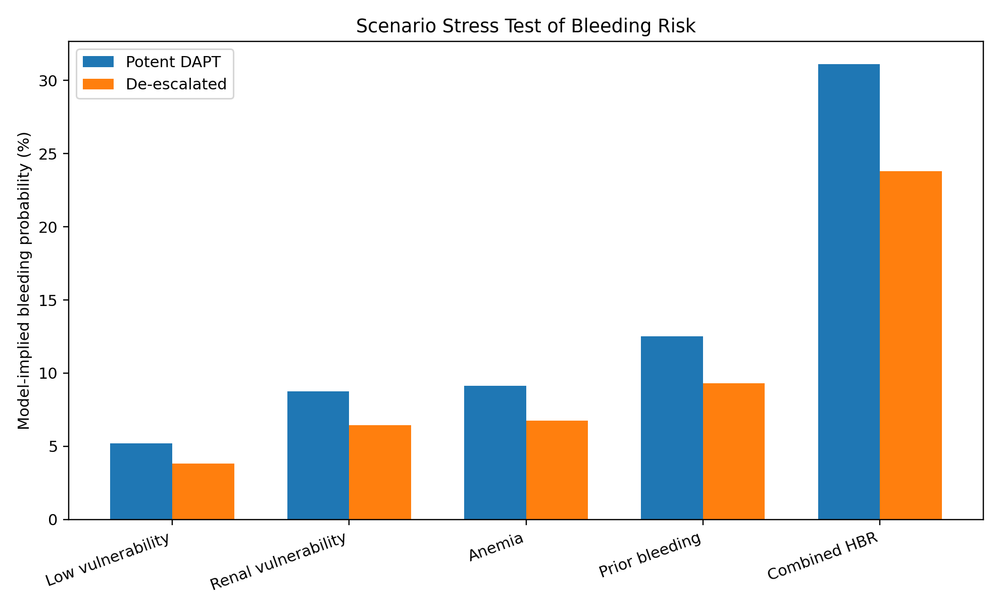
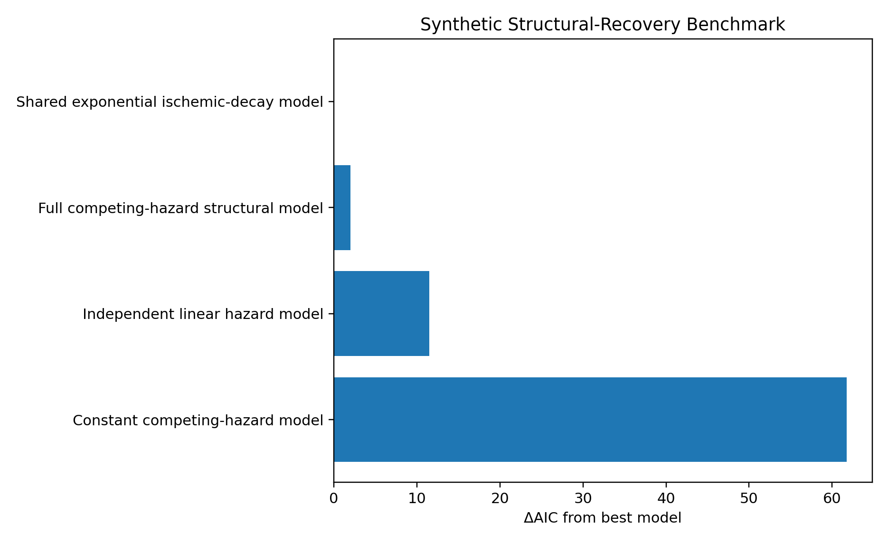

# PCI Bleeding–Ischemia Dynamic Model

## Dynamical Modelling of Bleeding–Ischemia Risk Surfaces for Antithrombotic De-escalation after PCI Based on Hemoglobin, Renal Function, and Prior Bleeding

A literature-parameterized computational proof-of-concept for studying the dynamic balance between bleeding and ischemic risk following percutaneous coronary intervention (PCI).

The framework combines competing-hazard modelling, coupled ordinary differential equations, sequential expected-loss minimization, optimal stopping, uncertainty propagation, global sensitivity analysis, stochastic perturbation, and synthetic model comparison.

## Overview

Antithrombotic therapy after PCI involves a competing-risk problem: sustained treatment intensity may reduce ischemic risk while increasing bleeding burden. The relative importance of these risks may change over time and according to patient vulnerability.

This computational framework represents that trade-off using:

- Hemoglobin
- Estimated glomerular filtration rate (eGFR)
- Prior bleeding
- Time after a 30-day post-index landmark
- Antithrombotic treatment intensity

The model generates theoretical switching surfaces describing when de-escalation becomes favorable under the assumed structural parameters.

## Mathematical Model

The model includes continuous vulnerability functions for hemoglobin and renal function, competing bleeding and ischemic hazards, coupled latent-state equations, and an expected-loss function.

The theoretical switching time is defined through:

`τ* = arg min L(τ)`

where the expected clinical loss combines model-implied bleeding probability, ischemic probability, and a switching penalty.

Complete equations are available in:

`equations/Model_Equations_List.txt`

## Computational Analysis

The repository contains:

- Dynamic bleeding–ischemia risk modelling
- Sequential expected-loss minimization
- Hemoglobin–eGFR switching surfaces
- Clinical vulnerability stress scenarios
- Latin hypercube sampling
- Partial rank correlation coefficient (PRCC) analysis
- Local elasticity analysis
- Stochastic perturbation analysis
- Numerical solver robustness assessment
- Synthetic AIC structural-recovery benchmark

## Repository Structure

```text
pci-bleeding-ischemia-dynamic-model/
├── data/          Literature sources and model parameters
├── equations/     Mathematical model equations
├── figures/       Computational figures
├── results/       Simulation and sensitivity outputs
├── src/           Python source code
├── CITATION.cff   Citation metadata
├── LICENSE        MIT License
├── README.md      Project documentation
└── requirements.txt
```

## Key Computational Results

For the reference profile (hemoglobin 11.5 g/dL, eGFR 45 mL/min/1.73 m², and no prior bleeding), the loss-minimizing theoretical switch occurred 3.0 months after the 30-day landmark.

Across the predefined vulnerability scenarios, the theoretical switching time ranged from the 30-day boundary in the combined high-bleeding-risk scenario to 4.6 months after the landmark in the low-vulnerability scenario.

Under 600 stochastic perturbations, the median theoretical switching time was 2.8 months after the 30-day landmark, with a 2.5th–97.5th percentile range of 0.0–4.0 months.

Global sensitivity analysis identified treatment-related bleeding amplification, baseline ischemic hazard, baseline bleeding hazard, and the bleeding/ischemic utility weights among the principal structural drivers of the switching boundary.

These values are simulation outputs and must not be interpreted as validated clinical treatment thresholds.

## Selected Figures

### Sequential De-escalation Loss Curves



### Switching Surface Without Prior Bleeding



### Switching Surface With Prior Bleeding



### Reference Competing-Risk Dynamics



### Global Sensitivity Analysis



### Stochastic Switching-Time Distribution



### Scenario Bleeding Stress Test



### Synthetic Structural-Recovery Benchmark



## Installation

Clone the repository and install the required Python packages:

```bash
git clone https://github.com/TitinPrihantini4/pci-bleeding-ischemia-dynamic-model.git
cd pci-bleeding-ischemia-dynamic-model
pip install -r requirements.txt
```

## Reproducibility

The primary computational implementation is located in:

```text
src/pci_dynamic_model.py
```

Supporting outputs are provided in the `results/` directory, while model parameters and literature-derived clinical anchors are provided in `data/`.

A fixed random seed is used in the computational implementation to support reproducibility of stochastic analyses.

## Evidence Status and Research Integrity

This repository contains a theoretical and computational proof-of-concept.

No patient-level registry records, prospective observations, laboratory measurements, or unpublished clinical datasets were analyzed.

Published studies were used to define observable variables, clinical landmarks, event-rate ranges, and biologically plausible directions. Structural hazard coefficients, latent-state parameters, utility weights, switching costs, and stochastic quantities remain provisional unless explicitly identified as literature-derived.

The numerical findings are reproducible simulation outputs. They are not validated clinical effect estimates, treatment thresholds, diagnostic performance measures, or treatment recommendations.

Patient-level calibration and external validation are required before clinical interpretation or use in patient care.

## Intended Use

The framework is intended for methodological research, hypothesis generation, reproducibility studies, and future retrospective or prospective validation in cardiovascular pharmacotherapy and interventional cardiology.

It is not intended for direct clinical decision-making.

## Citation

If you use this repository, please cite the software using the metadata provided in `CITATION.cff`.

## License

This project is distributed under the MIT License.
